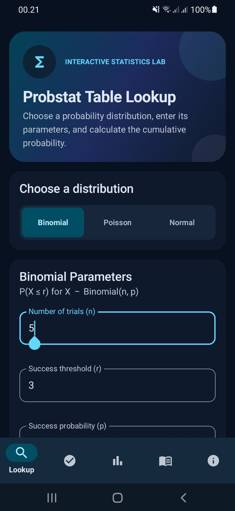
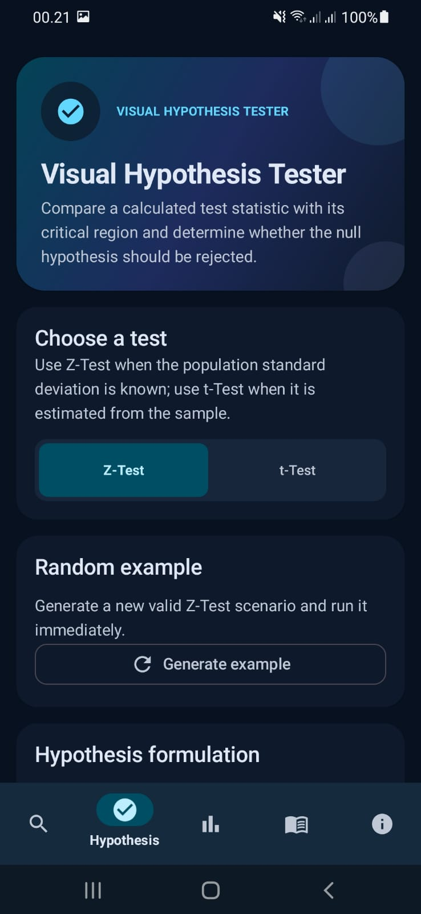
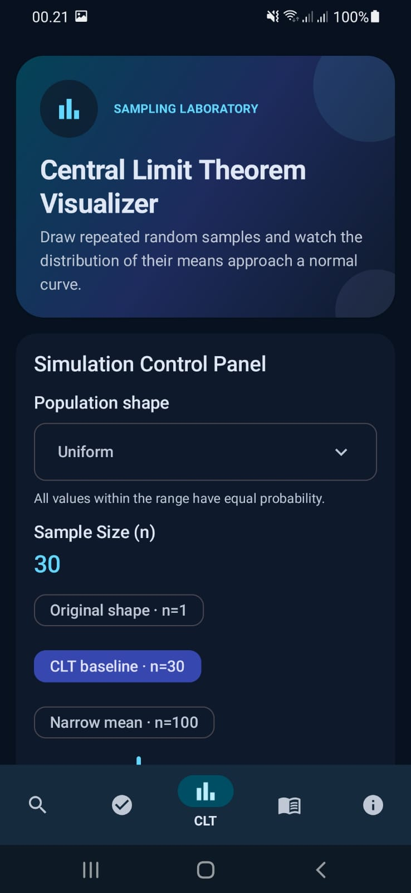
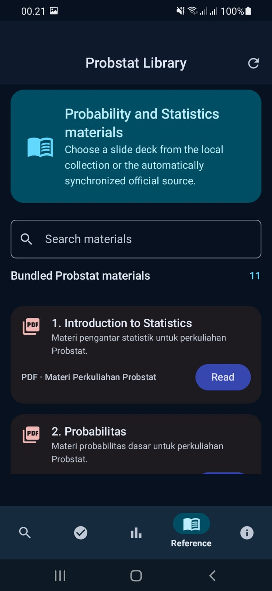
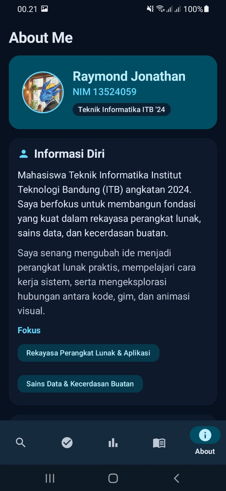
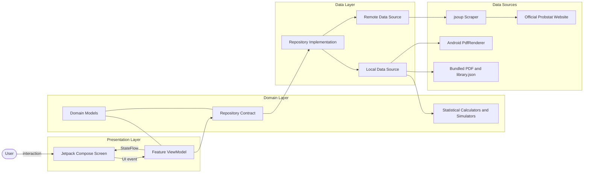
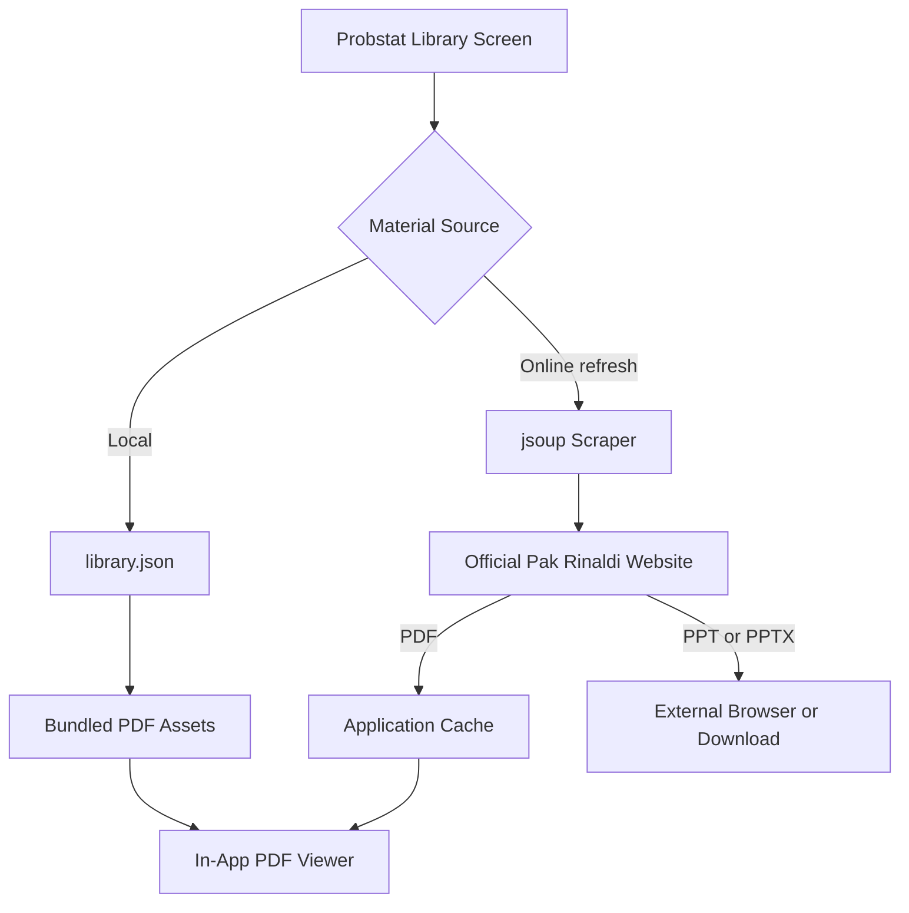

# StatsDroid

StatsDroid adalah aplikasi Android native untuk mempelajari konsep Probabilitas dan Statistika melalui kalkulasi, visualisasi, simulasi, dan materi perkuliahan. Aplikasi ini dikembangkan untuk tugas seleksi asisten Laboratorium IRK 2026, **IRK Library II: StatsDroid**.

Fitur utama dan koleksi PDF bawaan dapat digunakan tanpa internet. Koneksi internet hanya diperlukan untuk memperbarui materi tambahan dari situs resmi Pak Rinaldi Munir.

## Fitur Utama

### Probability Lookup

- Probabilitas kumulatif Binomial berdasarkan jumlah percobaan, ambang keberhasilan, dan probabilitas sukses.
- Probabilitas kumulatif Poisson berdasarkan rata-rata kejadian dan ambang yang dipilih.
- Probabilitas kumulatif Normal Standar dengan input manual dan slider yang tersinkronisasi.
- Kurva Normal interaktif dengan area peluang yang diarsir sampai nilai *z-score* terpilih.

### Visual Hypothesis Tester

- Uji satu sampel **Z-Test** dan **t-Test**.
- Alternatif uji sisi kiri, sisi kanan, dan dua sisi.
- Pilihan tingkat signifikansi `0.01`, `0.05`, dan `0.10`.
- Perhitungan statistik uji, *p-value*, nilai kritis, dan keputusan secara otomatis.
- Visualisasi daerah penolakan, area *p-value*, nilai kritis, dan posisi statistik uji.

### Central Limit Theorem Visualizer

- Pilihan populasi Uniform, Eksponensial, dan Bimodal.
- Ukuran sampel dari `1` sampai `100`.
- Pilihan jumlah simulasi `100`, `500`, `1.000`, atau `5.000` sampel.
- Histogram populasi asli dan distribusi rata-rata sampel.
- Kurva Normal teoritis menggunakan rata-rata populasi dan *standard error*.
- Perbandingan metrik teoritis dan empiris.

### Probstat Reference Library

- Katalog materi perkuliahan Probstat dalam format PDF.
- Sebelas materi PDF telah disertakan melalui katalog lokal `library.json`.
- Fitur pencarian berdasarkan judul, deskripsi, sumber, dan tahun ajaran.
- PDF lokal dapat dibaca langsung di dalam aplikasi.
- PDF daring diunduh ke cache aplikasi sebelum ditampilkan.
- Materi PPT/PPTX daring tetap ditampilkan sebagai sumber eksternal karena PDF viewer tidak merender format PowerPoint.
- Sinkronisasi otomatis materi dari situs resmi Pak Rinaldi Munir menggunakan jsoup.
- Scraper memilih direktori tahun ajaran tertinggi yang tersedia dan menyimpan hasil selama 24 jam.
- Koleksi lokal tetap dapat digunakan ketika sinkronisasi daring gagal.

### About Me

- Informasi pembuat aplikasi.
- Motivasi pengembangan StatsDroid.
- Visi dan misi sebagai asisten Laboratorium IRK.
- Tautan GitHub, Instagram, dan repositori proyek.

## Screenshots

| Lookup | Hypothesis | CLT |
|---|---|---|
|  |  |  |

| Reference | About Me |
|---|---|
|  |  |

## Technology Stack

- Kotlin
- Jetpack Compose
- Material 3
- Navigation Compose
- Android ViewModel
- StateFlow dan SavedStateHandle
- Kotlin Coroutines
- Hilt Dependency Injection
- Kotlin Symbol Processing
- Apache Commons Statistics Distribution
- Android PdfRenderer
- jsoup HTML Parser
- Gradle Version Catalog

## Arsitektur

StatsDroid menggunakan **feature-based MVVM**. Setiap halaman mempunyai state, event, ViewModel, dan data layer sendiri, sedangkan komponen statistik yang dapat digunakan bersama ditempatkan di dalam package `core`.



### Alur Reference Library



### Pembagian Tanggung Jawab

| Lapisan | Lokasi utama | Tanggung jawab |
|---|---|---|
| Presentation | `feature/*/presentation` | Menampilkan UI, mengirim event, dan mengamati `StateFlow`. |
| Domain | `feature/*/domain` | Menyimpan model, aturan fitur, calculator, simulator, dan kontrak repository. |
| Data | `feature/*/data` | Memuat data lokal/daring dan mengimplementasikan repository. |
| Core | `core/statistics` | Menyediakan kalkulasi distribusi dan model statistik yang dipakai bersama. |
| Dependency Injection | `di` | Menyediakan binding Hilt dan coroutine dispatcher. |
| Shared UI | `ui/components` dan `ui/theme` | Menyediakan komponen visual, warna, tipografi, bentuk, dan spacing aplikasi. |
| Navigation | `navigation` | Mendefinisikan lima destination pada bottom navigation. |

## Kualitas Struktur Kode

### Readability

Nama class, event, dan field state menggunakan istilah yang sesuai dengan konsep statistik. Parsing input, validasi, kalkulasi, penyimpanan state, dan rendering dipisahkan agar setiap class mempunyai tanggung jawab yang jelas. Komentar digunakan terutama untuk keputusan numerik, simulasi, atau rendering yang tidak langsung terlihat dari kode.

### Modularity

Setiap fitur diletakkan dalam package terpisah dan tidak bergantung pada presentation layer fitur lain. Komunikasi dengan data layer dilakukan melalui kontrak repository, sedangkan kalkulator statistik tidak bergantung pada Compose. Struktur ini membuat perubahan pada satu halaman tidak memaksa perubahan besar pada halaman lainnya.

### Extensibility

Fitur baru dapat ditambahkan dengan pola yang sama:

1. Tambahkan package baru di bawah `feature`.
2. Definisikan model domain dan kontrak repository.
3. Tambahkan local atau remote data source bila diperlukan.
4. Kelola immutable UI state melalui ViewModel.
5. Bangun layar menggunakan komponen Compose bersama.
6. Daftarkan binding Hilt dan destination navigasi.

Pola tersebut memungkinkan penambahan topik IRK lain, seperti matriks, sistem persamaan linear, kriptografi, atau Huffman coding, tanpa menulis ulang fitur yang sudah ada.

## State dan Lifecycle

- UI state disediakan melalui `StateFlow`.
- Compose mengamati state menggunakan `collectAsStateWithLifecycle()`.
- Input penting disimpan melalui `SavedStateHandle`.
- Simulasi CLT, scraping, pengunduhan PDF, dan rendering PDF dijalankan pada background dispatcher.
- CLT memiliki cancellation dan perlindungan terhadap stale result.
- Hasil scraper disimpan sementara selama 24 jam agar aplikasi tidak selalu meminta halaman yang sama.

## Menambahkan Materi Probstat Lokal

### 1. Konversi PPT/PPTX menjadi PDF

Gunakan fitur **Export as PDF** pada PowerPoint, LibreOffice Impress, atau aplikasi presentasi lain.

### 2. Simpan file PDF

Letakkan file di:

```text
app/src/main/assets/reference/probstat/
```

Contoh:

```text
app/src/main/assets/reference/probstat/7-Teorema-Limit-Pusat.pdf
```

### 3. Tambahkan metadata ke katalog

Edit file:

```text
app/src/main/assets/reference/library.json
```

Contoh entri:

```json
{
  "id": "probstat-07-teorema-limit-pusat",
  "title": "7. Teorema Limit Pusat",
  "description": "Materi distribusi rata-rata sampel dan Teorema Limit Pusat.",
  "sourceName": "Materi Perkuliahan Probstat",
  "academicYear": "2025-2026",
  "fileType": "PDF",
  "assetPath": "reference/probstat/7-Teorema-Limit-Pusat.pdf"
}
```

Setelah aplikasi dibangun ulang, materi akan muncul otomatis pada bagian koleksi lokal.

## Automatic Scraper

Scraper mengakses direktori resmi Probstat Pak Rinaldi Munir, mencari halaman dengan pola tahun ajaran `YYYY-YYYY`, memilih tahun tertinggi yang tersedia, lalu mengambil tautan PDF, PPT, dan PPTX. Tautan yang mengarah ke nilai, ujian, kuis, makalah, dan foto dikecualikan.

Kegagalan jaringan tidak menghapus atau memblokir koleksi PDF lokal. Pengguna juga dapat memicu sinkronisasi ulang melalui tombol refresh pada halaman Reference.

## Requirements

- Android Studio yang kompatibel dengan Android Gradle Plugin 9.3.1
- JDK 21
- Android SDK 36
- Minimum Android 8.0 / API 26
- Koneksi internet untuk sinkronisasi materi daring

## Menjalankan Aplikasi

### Android Studio

1. Klon atau ekstrak repository.
2. Buka root project melalui Android Studio.
3. Tunggu Gradle Sync selesai.
4. Pilih emulator atau perangkat fisik dengan USB debugging aktif.
5. Tekan **Run**.

### Command Line

Windows:

```powershell
.\gradlew.bat assembleDebug
```

Linux atau macOS:

```bash
./gradlew assembleDebug
```

APK debug tersedia di:

```text
app/build/outputs/apk/debug/app-debug.apk
```

Pemeriksaan lint:

```powershell
.\gradlew.bat lintDebug
```


## Sumber Materi

PDF lokal berasal dari materi perkuliahan Probabilitas dan Statistika yang dimasukkan ke dalam project. Materi tambahan dari Pak Rinaldi Munir ditampilkan melalui tautan situs resminya. 
## Lisensi

StatsDroid menggunakan Lisensi MIT.

Lisensi MIT dipilih karena mengizinkan penggunaan, penyalinan, modifikasi, distribusi, sublisensi, penggunaan pribadi, dan penggunaan komersial, dengan syarat pemberitahuan hak cipta dan lisensi tetap disertakan. Lisensi ini juga menyediakan perangkat lunak tanpa jaminan dan membatasi tanggung jawab penulis. Dengan begitu, project ini mudah dipelajari dan dikembangkan kembali tanpa menghilangkan atribusi.

## Creator

**Raymond Jonathan**  
NIM: **13524059**  
